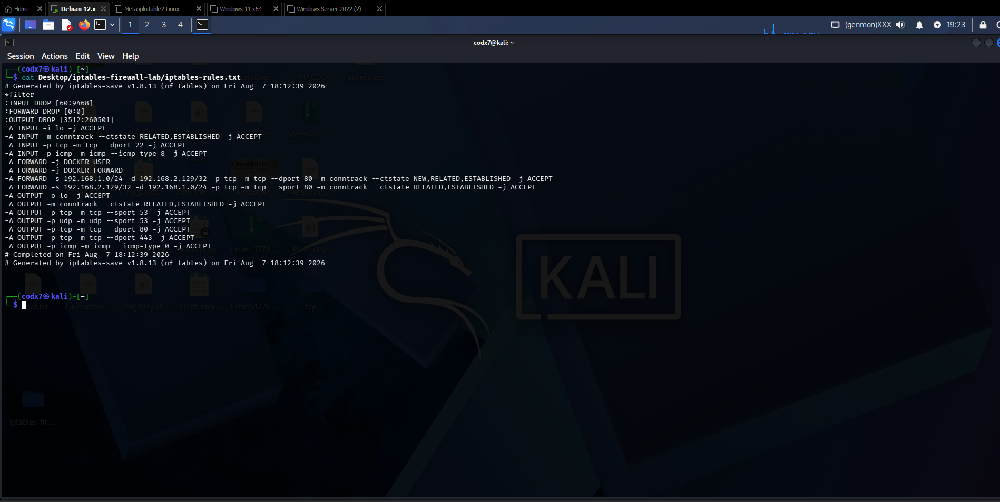
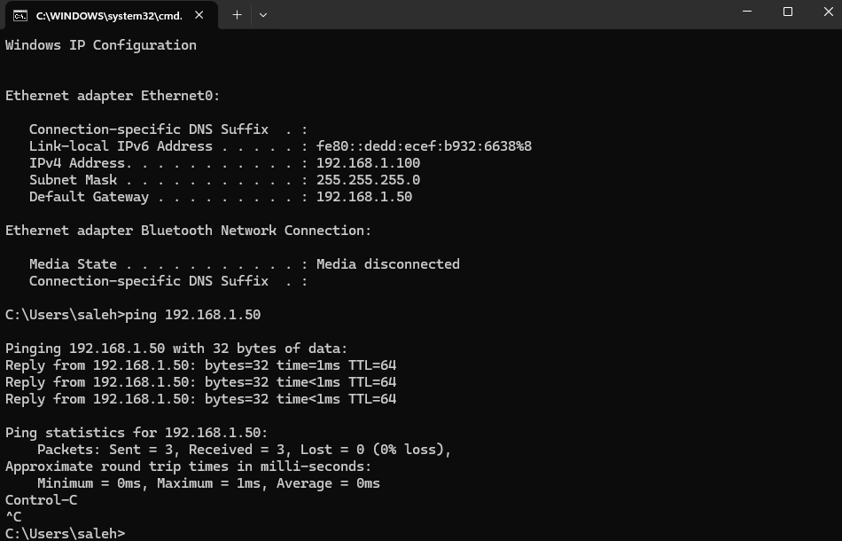
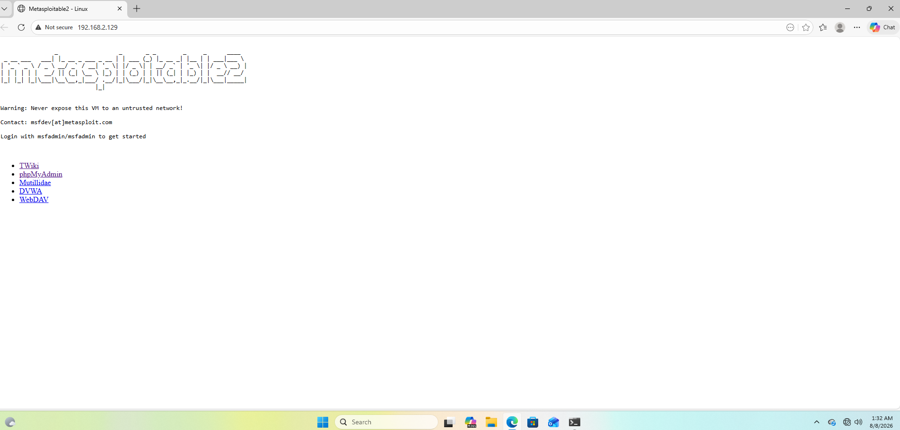

<div align="center">


</div>

---

## 📌 Overview

A hands-on home lab demonstrating **Linux firewall configuration using iptables**, built to practice **default-deny security policy**, **network segmentation**, and **controlled traffic forwarding** between an untrusted external network and a protected internal network — modeling how a real enterprise firewall/gateway enforces access control at a network boundary.

---

## 🗺️ Network Topology

<div align="center">

| Role | Device | IP Address | Network |
|---|---|---|---|
| 🛡️ **Firewall / Gateway** | Kali Linux | `192.168.1.50` (eth0) / `192.168.2.128` (eth1) | Dual-homed |
| 🌐 **External / Untrusted Host** | Windows Client | `192.168.1.100` | External (`192.168.1.0/24`) |
| 🎯 **Public-Facing Server** | Metasploitable2 | `192.168.2.129` | Internal (`192.168.2.0/24`) |
| 🔒 **Protected Internal Asset** | Windows Server | Internal | Internal (`192.168.2.0/24`) |

</div>

```
   🌐 External Network              🛡️ FIREWALL (Kali)              🔒 Internal Network
  ┌───────────────────┐         ┌──────────────────────┐        ┌───────────────────────┐
  │   Windows Client    │──────▶│  eth0 ─ iptables ─ eth1 │──────▶│  Metasploitable2 ✅     │
  │  192.168.1.100       │        │  default-deny policy    │        │  192.168.2.129           │
  └───────────────────┘         └──────────────────────┘        │  Windows Server ❌         │
                                                                     └───────────────────────┘
```

---

## ⚙️ What Was Configured

- 🖧 Static IP addressing & routing across two isolated VMware host-only networks (`VMnet0`, `VMnet2`)
- 🔀 IP forwarding enabled on Kali (`net.ipv4.ip_forward=1`) so it can route between networks
- 🚫 **Default-deny** iptables policy across `INPUT`, `OUTPUT`, and `FORWARD` chains
- ✅ Explicit allow rules for:
  - Loopback traffic
  - Stateful connection tracking (`ESTABLISHED`, `RELATED` via `conntrack`)
  - SSH access to the firewall itself
  - DNS / HTTP / HTTPS outbound from the firewall
  - ICMP (ping) for testing/troubleshooting
  - Forwarded HTTP traffic (port 80) — external → Metasploitable, **both directions**
- 🧭 Default gateways configured on client/server VMs pointing to the firewall's relevant interface

---

## ✅ Results
**main-lab:**
<div align="center">
   
   </div>

**1. Basic reachability confirmed through the firewall's external interface:**

<div align="center">

</div>

**2. Forwarded HTTP traffic successfully reaches the public-facing server:**

<div align="center">

</div>

> Traffic from the external network reached the designated public-facing server (Metasploitable, port 80) **only**, while all other paths remained blocked by the default-deny `FORWARD` policy — proving the segmentation model works as designed.

---

## 🧩 Key Commands

```bash
# Enable IP forwarding
sudo sysctl -w net.ipv4.ip_forward=1

# Default-deny policies
sudo iptables -P INPUT DROP
sudo iptables -P OUTPUT DROP
sudo iptables -P FORWARD DROP

# Core FORWARD rule — external → Metasploitable, port 80 (both directions)
sudo iptables -A FORWARD -s 192.168.1.0/24 -d 192.168.2.129 -p tcp --dport 80 \
  -m conntrack --ctstate NEW,ESTABLISHED,RELATED -j ACCEPT
sudo iptables -A FORWARD -s 192.168.2.129 -d 192.168.1.0/24 -p tcp --sport 80 \
  -m conntrack --ctstate ESTABLISHED,RELATED -j ACCEPT
```

📄 Full ruleset: [`iptables-rules.txt`](iptables-rules.txt)

---

## 🎓 What I Learned

- The difference between **routing** (path decision) and **firewalling** (permission decision), and how they work together
- `INPUT` vs `OUTPUT` vs `FORWARD` chains, and exactly when each applies
- Stateful filtering with `conntrack` (`NEW` / `ESTABLISHED` / `RELATED`) and why return traffic needs its own explicit rule
- Practical troubleshooting using `iptables -L -v -n` packet counters, `tracert`, and routing tables
- Why firewall/interface configuration must be made **persistent** (`iptables-persistent`, `nmcli`) to survive reboots

---

## 🚀 Next Steps

- [ ] Explicitly verify Windows Server is unreachable from the external network (segmentation proof)
- [ ] Make interface IPs and iptables rules fully persistent
- [ ] Layer a basic IDS (e.g., Suricata) on top of the firewall
- [ ] Add logging rules to capture blocked traffic attempts

---

<div align="center">


</div>
